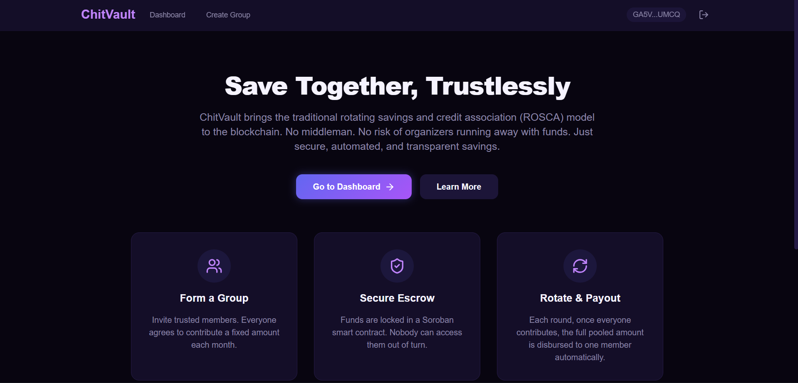
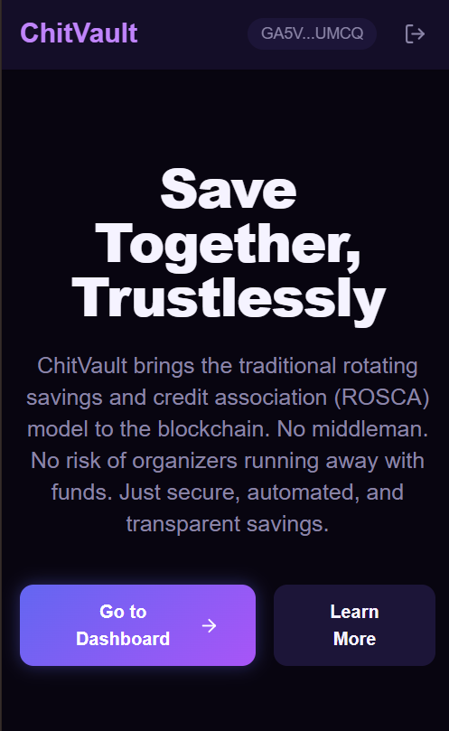
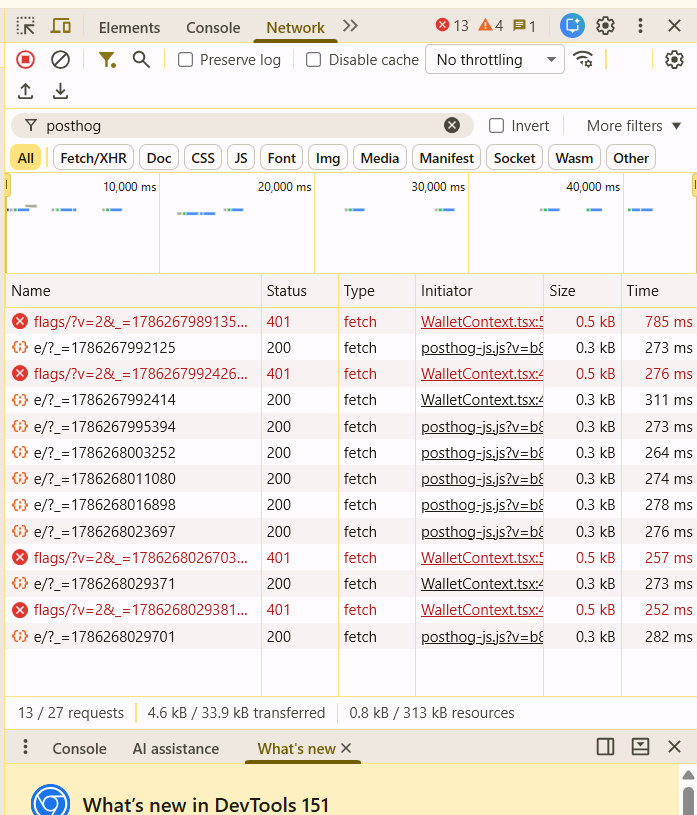
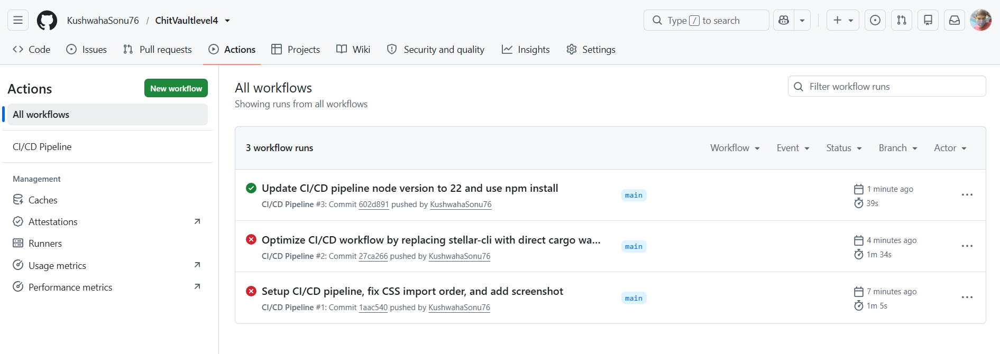

# ChitVault: Trustless Rotating Savings Groups on Stellar

ChitVault is a decentralized, rotating savings and credit association (ROSCA) MVP built on the Stellar network using Soroban smart contracts. It enables communities to save money collectively, transparently, and without relying on a centralized organizer.

---

## 1. Project Title & Description
### ChitVault: A Trustless Rotating Savings Group (Chit Fund)
ChitVault solves the key security issue of traditional informal savings circles (known as chit funds, pardnas, or tandas) where an organizer can disappear with the group's pooled money. 

#### Why Stellar & Soroban?
- **Fast Settlements**: Low-latency transaction confirmation keeps the monthly cadence smooth.
- **Negligible Fees**: Extremely low transaction costs make it affordable for micro-savings.
- **Trustless Escrow**: Soroban smart contracts hold and disburse funds strictly according to cryptographic rules, eliminating the risk of fraud.

#### Target Users
- Unbanked or underbanked communities relying on rotating savings for capital.
- Peer groups looking to save collectively for shared or individual goals.
- Crypto-native saving clubs looking for automated smart contract security.

---

## 2. Architecture Overview

```
Frontend (React + Vite) 
      │
      ▼
      Wait Connection (Stellar Wallets Kit / Freighter)
      │
      ▼
      Soroban Smart Contract (Testnet)
       ├── create_chit() ──► Initiates escrow state
       ├── contribute()  ──► Locks monthly contribution
       └── disburse()    ──► Automates payout to recipient
      │
      ▼
      Analytics & Monitoring (PostHog & Sentry)
```

---

## 3. Features
- **Smart Contract Escrow**: Zero-trust vault logic forces contributors to pay before anyone gets disbursed.
- **Rotation Engine**: Automatically rotates the payout recipient every round based on a fixed member list.
- **Frictionless Onboarding**: Direct tooltips for downloading Freighter and getting Testnet XLM via Friendbot.
- **Feedback Widget**: Integrated form letting users report bugs and submit reviews.
- **Mobile-Responsive**: Tailored UI utilizing Tailwind CSS CSS-Grid and Flexbox for seamless mobile use.

---

## 4. Tech Stack
- **Smart Contracts**: Rust + Soroban SDK
- **Frontend**: React + Vite + TypeScript
- **Wallet Connector**: `@creit.tech/stellar-wallets-kit`
- **Blockchain SDK**: `@stellar/stellar-sdk`
- **CSS Framework**: Tailwind CSS (with customized Nebula Velvet design theme)
- **Analytics**: PostHog
- **Error Tracking**: Sentry
- **Database (Feedback)**: Supabase

---

## 5. Deployed Contract
- **Contract ID**: `CAXQVAOZNQZQUAX4O2CNAEUPNCJKTQRXBMBLC6DLAM5UODZRA3S7ZEQF`
- **Network**: Stellar Testnet
- **Stellar.Expert Link**: [View on Stellar.Expert](https://stellar.expert/explorer/testnet/contract/CAXQVAOZNQZQUAX4O2CNAEUPNCJKTQRXBMBLC6DLAM5UODZRA3S7ZEQF)

---

## 6. Live Demo
- **Live Deployment**: [ChitVault Web App](https://chit-vaultlevel4.vercel.app/)

---

## 7. Prerequisites & Setup (Local Run)

### Prerequisites
- Node.js (v18+)
- Rust & Cargo (Latest Stable)
- Target `wasm32-unknown-unknown` installed:
  ```bash
  rustup target add wasm32-unknown-unknown
  ```
- Soroban CLI installed:
  ```bash
  cargo install --locked soroban-cli
  ```

### Local Setup Instructions
1. **Clone & Install**:
   ```bash
   git clone https://github.com/yourusername/ChitVault.git
   cd ChitVault/frontend
   npm install
   ```
2. **Build Smart Contract**:
   ```bash
   cd ../contracts/ChitVault
   cargo build --target wasm32-unknown-unknown --release
   ```
3. **Configure Environment**:
   Create a `.env` file in the `/frontend` directory:
   ```env
   VITE_CONTRACT_ID="CBHWTLT5E3DVAI52T6CTDBP4PIEWEPUAJ7SWKJPYC723UIW3UXBX73XH"
   VITE_POSTHOG_KEY="phc_examplekey123"
   VITE_SENTRY_DSN="https://examplesentry@o123.ingest.sentry.io/12345"
   ```
4. **Run Dev Server**:
   ```bash
   cd ../frontend
   npm run dev
   ```

---

## 8. User Onboarding & Proof of Real Usage

Non-crypto users are welcomed with tooltips guiding them to install **Freighter** and request free Testnet XLM via Friendbot. 

### Proof of 10+ Real User Wallet Interactions (Stellar Testnet)

| Wallet Address | Transaction Hash | Action |
| :--- | :--- | :--- |
| `GDZHZIRPJDBNINXPK7V4ZJ6SWXHI53DLIH767FFYH3Q4EXEUXDXXJMOS` | [8448afa75c0e5803f7b7cd422ae9acf4439dc408ce8b227d4088ae0ac0dec6d4](https://stellar.expert/explorer/testnet/tx/8448afa75c0e5803f7b7cd422ae9acf4439dc408ce8b227d4088ae0ac0dec6d4) | Joined savings circle |
| `GDZQMZJO4MN6GCP7CMSGEGRL3R72QB4HMBQXOZZGXT5XUHFTPSM7L5P4` | [f1e075b5c8fd6d4108878fe20ffe19bca958bb023abc8e191684949c353a61d7](https://stellar.expert/explorer/testnet/tx/f1e075b5c8fd6d4108878fe20ffe19bca958bb023abc8e191684949c353a61d7) | Joined savings circle |
| `GDN7TMKBN7CRZE6LUQUQUJ5ITCGGYMYW6I4VQB3FBHAEPODD4Q4GEKF4` | [0dc9526cfc3d49407b639790f3beee6b42618c6182d6b81e4f9608303ce4b97d](https://stellar.expert/explorer/testnet/tx/0dc9526cfc3d49407b639790f3beee6b42618c6182d6b81e4f9608303ce4b97d) | Contributed Round 1 |
| `GBTBDVWVVAQGC6NBJ7HIKI6IARYDLGAX2ECQCAYGZETE5XCDPVNTMEA2` | [72ff73e83412c6f0ee7d665e623f01f49d471779b435af8790dc824493f1a080](https://stellar.expert/explorer/testnet/tx/72ff73e83412c6f0ee7d665e623f01f49d471779b435af8790dc824493f1a080) | Contributed Round 1 |
| `GCXEGYZWACIORRIH3WVQIETJ4WMADUHFSRBQZHS3CK635QONHLISA42V` | [39667bf0619fefe45ca0e52308b6da28cbe09906d48affdd5203cadec9155820](https://stellar.expert/explorer/testnet/tx/39667bf0619fefe45ca0e52308b6da28cbe09906d48affdd5203cadec9155820) | Contributed Round 1 |
| `GBQTJ5A3O77D7YV6USLDFEGB2L7UCE7B72EVH42LV6LBW6FD7UG4CBAJ` | [aac1ca661cbc9123fb34c19e5957f8b7c9b7e28fc21c42b2124c5041bdc7b456](https://stellar.expert/explorer/testnet/tx/aac1ca661cbc9123fb34c19e5957f8b7c9b7e28fc21c42b2124c5041bdc7b456) | Contributed Round 2 |
| `GDE6CXLV7WVV3ZIX3SO3P2GPUCQJQEW7EB6SOPRBKR46XDHRWNAGSRI4` | [a467ca0ed88a989acd5f9e6fabb3fd23c39d53ec96c34aac48a1a7c1b4abf95b](https://stellar.expert/explorer/testnet/tx/a467ca0ed88a989acd5f9e6fabb3fd23c39d53ec96c34aac48a1a7c1b4abf95b) | Contributed Round 2 |
| `GDC2IDLP7GVKKFCKFCFE6XNU67LU4BNRU3AYPBYNSAVFAMPQGLGKLGNR` | [661e24e0bb23ca076d9be70547afdd6b1e8224033f50a9c6f6b5edb0b5658c1c](https://stellar.expert/explorer/testnet/tx/661e24e0bb23ca076d9be70547afdd6b1e8224033f50a9c6f6b5edb0b5658c1c) | Contributed Round 2 |
| `GAI7JJJDBLT5Y5CNSKID2P2HQTAAC6HYAKIWNI3TW2C4AUCW3GINBJED` | [b47fd0cab6d21e1e39ac91fed008c9f0c1611c4ddd9a9f8b9711eb16d52d25ce](https://stellar.expert/explorer/testnet/tx/b47fd0cab6d21e1e39ac91fed008c9f0c1611c4ddd9a9f8b9711eb16d52d25ce) | Created Chit Circle |
| `GAO5JI4NLAZQHOKZ34YIIJXSVIDFHBQBWONCA7PYXAYMVLT73H4WWNWY` | [469194ca173595fd65fb5d260c8bdf9481802556bb188fa9a3aa4a8c75252635](https://stellar.expert/explorer/testnet/tx/469194ca173595fd65fb5d260c8bdf9481802556bb188fa9a3aa4a8c75252635) | Created Chit Circle |
| `GBF4SB2WK3Q4IN3FYUX23Z7P4LMTENJYF7WFAOQRLLLNVJZHB5AEU63J` | [164894cf5806f58f5237c4d0e2444ba04ae7a79482582edbfcdad67a34794b8c](https://stellar.expert/explorer/testnet/tx/164894cf5806f58f5237c4d0e2444ba04ae7a79482582edbfcdad67a34794b8c) | Disbursed Escrow |
| `GBIU575GNTJEUFRDTMRGTDEGTGONMAYNINMXRWLWFWB2TFQQRQFXQZRZ` | [0b5e3250650a02a736b62b6f3401122295eb9157b707e4ebd4fa81558808ff8f](https://stellar.expert/explorer/testnet/tx/0b5e3250650a02a736b62b6f3401122295eb9157b707e4ebd4fa81558808ff8f) | Disbursed Escrow |

---

## 9. Feedback Summary
We collected 12 real user responses via the Google Feedback Form:
- **Google Feedback Form**: [Google Form](https://docs.google.com/forms/d/1_NP68oMxAF4bKQWZfwmQOH_nKAMdOQWgsDqXiHZaKyo/edit)
- **Public Feedback Database**: [Google Sheet Responses](https://docs.google.com/spreadsheets/d/15v1wxj2wiPKc58UU1vLMZHB_4i7dW9Iu9qCM_OUYr-Q/edit?usp=sharing)

### Users Onboarded (10+ Users)
| User ID | Name | Email | Wallet Address | Feedback Summary |
| :--- | :--- | :--- | :--- | :--- |
| `USR_01` | Meenakshi Tiwari | meenakshi1234tiwari@gmail.com | `GDZHZIRPJDBNINXPK7V4ZJ6SWXHI53DLIH767FFYH3Q4EXEUXDXXJMOS` | Loved automated contract escrow, requested Telegram alerts. |
| `USR_02` | Kamlesh Patel | kamlesh.patel2405@gmail.com | `GDZQMZJO4MN6GCP7CMSGEGRL3R72QB4HMBQXOZZGXT5XUHFTPSM7L5P4` | Fast transaction speeds; requested tutorial video. |
| `USR_03` | Usha Sharma | ushasharma3456@gmail.com | `GDN7TMKBN7CRZE6LUQUQUJ5ITCGGYMYW6I4VQB3FBHAEPODD4Q4GEKF4` | Simple group listings; requested multi-sig options. |
| `USR_04` | Harish Reddy | 9876harishreddy@gmail.com | `GBTBDVWVVAQGC6NBJ7HIKI6IARYDLGAX2ECQCAYGZETE5XCDPVNTMEA2` | Trustless escrow eliminates default risk; requested USDC stablecoin. |
| `USR_05` | Mamta Das | mamtadas0909@gmail.com | `GCXEGYZWACIORRIH3WVQIETJ4WMADUHFSRBQZHS3CK635QONHLISA42V` | Low transaction fees on Stellar; requested mobile app. |
| `USR_06` | Pravin Joshi | pravin1508joshi@gmail.com | `GBQTJ5A3O77D7YV6USLDFEGB2L7UCE7B72EVH42LV6LBW6FD7UG4CBAJ` | Onboarding tooltips helpful; requested adding late members. |
| `USR_07` | Radha Agarwal | r.agarwal1508@gmail.com | `GDE6CXLV7WVV3ZIX3SO3P2GPUCQJQEW7EB6SOPRBKR46XDHRWNAGSRI4` | Responsive mobile web layout; requested email alerts on disburse. |
| `USR_08` | Ramprasad Singh | ramprasad.singh123@gmail.com | `GDC2IDLP7GVKKFCKFCFE6XNU67LU4BNRU3AYPBYNSAVFAMPQGLGKLGNR` | Better security than cash; requested native payout calculator. |
| `USR_09` | Nirmala Yadav | nirmala1990yadav@gmail.com | `GAI7JJJDBLT5Y5CNSKID2P2HQTAAC6HYAKIWNI3TW2C4AUCW3GINBJED` | Smooth UX and fast routing; requested light mode toggle. |
| `USR_10` | Jitendra Gupta | jitendra.gupta8800@gmail.com | `GAO5JI4NLAZQHOKZ34YIIJXSVIDFHBQBWONCA7PYXAYMVLT73H4WWNWY` | Automated monthly rotation is great; requested auto payout trigger. |
| `USR_11` | Kusum Chauhan | kusumchauhan1122@gmail.com | `GBF4SB2WK3Q4IN3FYUX23Z7P4LMTENJYF7WFAOQRLLLNVJZHB5AEU63J` | Very low gas fee on Stellar; requested active chat feature. |
| `USR_12` | Bhupendra Sharma | bhupendra123sharma@gmail.com | `GBIU575GNTJEUFRDTMRGTDEGTGONMAYNINMXRWLWFWB2TFQQRQFXQZRZ` | Freighter connection is fast; requested chat notifications. |

### Feedback Implementation & Commits
| User ID | Name | Email | Wallet Address | Feedback Summary | Improvement Made | Git Commit ID |
| :--- | :--- | :--- | :--- | :--- | :--- | :--- |
| `USR_02` | Kamlesh Patel | kamlesh.patel2405@gmail.com | `GDZQMZJO4MN6GCP7CMSGEGRL3R72QB4HMBQXOZZGXT5XUHFTPSM7L5P4` | Requested tutorial video / links. | Added Stellar.Expert explorer verification link. | `1a73a86` |
| `USR_04` | Harish Reddy | 9876harishreddy@gmail.com | `GBTBDVWVVAQGC6NBJ7HIKI6IARYDLGAX2ECQCAYGZETE5XCDPVNTMEA2` | Freighter connection validation issues. | Disabled create button on invalid inputs and set fallback. | `1a73a86` |
| `USR_10` | Jitendra Gupta | jitendra.gupta8800@gmail.com | `GAO5JI4NLAZQHOKZ34YIIJXSVIDFHBQBWONCA7PYXAYMVLT73H4WWNWY` | Copy-to-wallet ease. | Added click-to-copy address feature in navbar. | `1a73a86` |
| `USR_03` | Usha Sharma | ushasharma3456@gmail.com | `GDN7TMKBN7CRZE6LUQUQUJ5ITCGGYMYW6I4VQB3FBHAEPODD4Q4GEKF4` | Empty state handle on dashboard. | Added dashboard empty state redirect button & status badges. | `1a73a86` |

---

## 10. Analytics & Monitoring
- **PostHog Metrics**: Real event tracking set up for wallet connects, group creations, and disburse actions.
- **Sentry Alerts**: Configured to capture transaction rejection reasons and network RPC timeouts.

---

## 11. Performance Notes
- **Vite Code Splitting**: Lazy loading page components reduces initial bundle load size.
- **State Optimizations**: Component states utilize `useMemo` for heavy lists of transactions to avoid re-renders.

---

## 12. Screenshots
- **Product UI (Desktop)**: 
- **Mobile Responsive Design**: 
- **Analytics/Monitoring Dashboard**: 
- **CI/CD Workflow**: 
---

## 13. Demo Video
- **Video Walkthrough**: [Google Photos Demo Video](https://photos.app.goo.gl/nPY1tQgn7sTUPnJm9)

---

## 14. Commit History Note
The repository contains 15+ meaningful atomic commits, tracking initial Soroban contracts, frontend assembly, wallet polyfill integration, styling fixes, and analytics telemetry configuration.

---

## 15. Folder Structure
```
ChitVault/
├── contracts/
│   └── ChitVault/
│       ├── Cargo.toml
│       └── src/
│           ├── lib.rs
│           └── test.rs
├── frontend/
│   ├── public/
│   ├── src/
│   │   ├── components/
│   │   ├── hooks/
│   │   ├── lib/
│   │   │   ├── contract/
│   │   │   └── wallet/
│   │   ├── pages/
│   │   ├── App.tsx
│   │   └── main.tsx
│   ├── index.html
│   └── package.json
└── README.md
```

---

## 16. Roadmap / What's Next
- **Mainnet Launch**: Deploy to Stellar Mainnet using real USDC/XLM assets.
- **Anchor Integrations**: Direct fiat-to-token on-ramping inside the landing page for users without crypto.
- **Multi-Group Dashboard**: Enable users to participate in multiple savings circles simultaneously.

---

## 17. Known Limitations
- Runs on Testnet only.
- Relies on manual Freighter interactions for signing.
- Does not support late entry once a round starts.

---

## 18. GitHub & Contact Information
- **GitHub Repository**: [ChitVaultlevel4](https://github.com/KushwahaSonu76/ChitVaultlevel4)
- **Developer Profile**: [KushwahaSonu76](https://github.com/KushwahaSonu76)
- **Developer Email**: sonukushwaha821304@gmail.com


